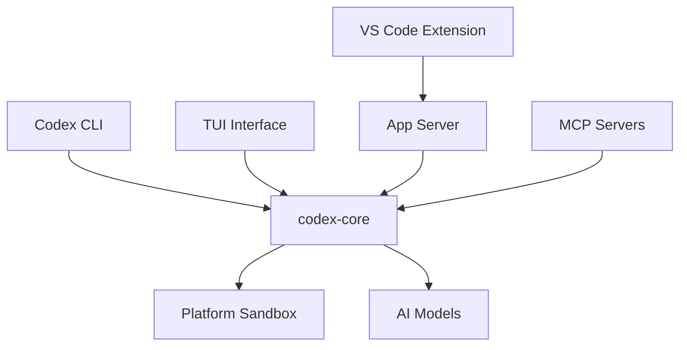

Codex CLI is built as a native, zero-dependency executable with a hybrid architecture combining Rust and TypeScript components.

## Monorepo Structure

The Codex repository is organized as a monorepo with two primary components:

<CardGroup cols={2}>
  <Card title="Rust Workspace" icon="rust" href="/architecture/rust-crates">
    Core business logic, TUI, and native execution (codex-rs/)
  </Card>
  <Card title="TypeScript CLI" icon="js">
    Wrapper for distribution and platform-specific integration
  </Card>
</CardGroup>

## Architecture Layers

The Codex architecture is structured in distinct layers:

### 1. Distribution Layer (TypeScript)

The TypeScript CLI wrapper provides:

- **npm packaging** — Install via `npm i -g @openai/codex`
- **Platform detection** — Routes to the correct native binary
- **Zero-dependency install** — All native binaries are bundled

### 2. Core Implementation (Rust)

The `codex-rs` Rust workspace contains the complete implementation:

<Accordion title="Business Logic (codex-core)">
  The `codex-core` crate implements all Codex business logic:
  - Conversation management and turn execution
  - Model interaction and streaming
  - Tool execution and sandboxing
  - Configuration and state management
  - Designed as a library crate for reuse across UIs
</Accordion>

<Accordion title="User Interfaces">
  Multiple frontend options built on `codex-core`:
  - **TUI (codex-tui)** — Fullscreen terminal interface using Ratatui
  - **Exec (codex-exec)** — Headless CLI for automation and scripts
  - **App Server (codex-app-server)** — JSON-RPC server for IDEs and integrations
  - **CLI (codex-cli)** — Multitool that provides all above via subcommands
</Accordion>

<Accordion title="Platform Services">
  Platform-specific sandboxing and security:
  - **macOS** — Seatbelt sandbox profiles
  - **Linux** — Landlock and Bubblewrap isolation
  - **Windows** — Process isolation and restrictions
  - **Cross-platform** — Process hardening and security primitives
</Accordion>

### 3. Integration Points

Codex integrates with external systems through multiple interfaces:

## Key Design Principles

<CardGroup cols={2}>
  <Card title="Native Performance" icon="gauge">
    Built in Rust for fast startup and efficient resource usage
  </Card>
  <Card title="Platform Security" icon="shield">
    OS-specific sandboxing on macOS, Linux, and Windows
  </Card>
  <Card title="Modular Architecture" icon="cubes">
    Shared core library with multiple interface options
  </Card>
  <Card title="Zero Dependencies" icon="box">
    Self-contained binaries with no runtime requirements
  </Card>
</CardGroup>

## Workspace Organization

The Rust workspace in `codex-rs/` uses Cargo workspaces with 60+ crates organized by function:

- **Core crates** — `core`, `cli`, `tui`, `exec`, `app-server`
- **Sandbox crates** — `linux-sandbox`, `process-hardening`
- **Protocol crates** — `protocol`, `app-server-protocol`, `rmcp-client`
- **Integration crates** — `mcp-server`, `lmstudio`, `ollama`
- **Utility crates** — `utils/*` for common functionality

<Info>
All workspace crates are prefixed with `codex-`. For example, the `core` folder contains the `codex-core` crate.
</Info>

## Configuration Management

Codex uses a layered configuration system:

- **User config** — `~/.codex/config.toml` (TOML format)
- **Requirements** — `requirements.toml` for constraints and policies
- **MDM integration** — Enterprise management on supported platforms

The Rust implementation uses `config.toml` instead of the legacy `config.json` format.

## Next Steps

<CardGroup cols={2}>
  <Card title="Rust Crates" icon="rust" href="/architecture/rust-crates">
    Explore the workspace structure and crate purposes
  </Card>
  <Card title="TUI Architecture" icon="terminal" href="/architecture/tui">
    Learn about the terminal interface implementation
  </Card>
  <Card title="Sandboxing" icon="lock" href="/architecture/sandboxing">
    Understand platform-specific security isolation
  </Card>
  <Card title="App Server" icon="server">
    JSON-RPC protocol for IDE integration
  </Card>
</CardGroup>
