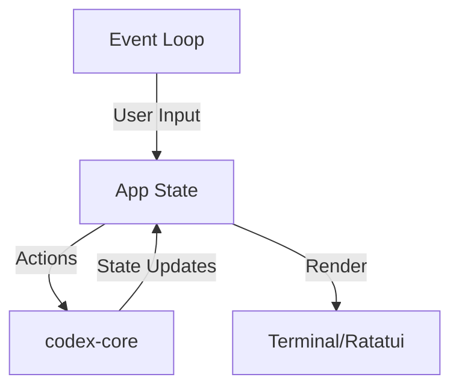

The Codex TUI is a fullscreen terminal interface built with [Ratatui](https://ratatui.rs/), providing an interactive experience for conversing with AI agents.

## Overview

The `codex-tui` crate implements the default interactive mode for Codex CLI, launched when you run `codex` without subcommands.

<Card title="Technology Stack" icon="layer-group">
  - **Ratatui 0.29.0** — Terminal UI framework
  - **Crossterm** — Cross-platform terminal manipulation
  - **Custom patches** — Forked ratatui and crossterm for color query support
</Card>

## Architecture Components

### App State Management

The TUI follows a centralized state model:



### Rendering Pipeline

<Steps>
  <Step title="Event Collection">
    Crossterm captures keyboard input, terminal resize, and other events.
  </Step>
  
  <Step title="State Update">
    Events are processed and update the app state, potentially triggering `codex-core` operations.
  </Step>
  
  <Step title="Widget Construction">
    Ratatui widgets are built from the current state.
  </Step>
  
  <Step title="Frame Rendering">
    The terminal frame is rendered with the new widget tree.
  </Step>
</Steps>

## Style System

The TUI follows strict style conventions defined in `codex-rs/tui/styles.md`:

### Color Palette

<CodeGroup>
```rust Headers
// Headers use bold
"Header".bold()
```

```rust Primary Text
// Default foreground color (no style)
"Primary text".into()
```

```rust Secondary Text
// Use dim for secondary text
"Secondary text".dim()
```
</CodeGroup>

### Semantic Colors

Colors are used semantically, not decoratively:

<CardGroup cols={2}>
  <Card title="Cyan" icon="circle" color="#00BFFF">
    **User input**, selection, status indicators
    
    ```rust
    "User input".cyan()
    ```
  </Card>
  
  <Card title="Green" icon="circle" color="#00FF00">
    **Success** messages and additions
    
    ```rust
    "+ Added".green()
    ```
  </Card>
  
  <Card title="Red" icon="circle" color="#FF0000">
    **Errors**, failures, deletions
    
    ```rust
    "- Deleted".red()
    ```
  </Card>
  
  <Card title="Magenta" icon="circle" color="#FF00FF">
    **Codex** agent identity
    
    ```rust
    "Codex".magenta()
    ```
  </Card>
</CardGroup>

<Warning>
**Avoid:**
- Custom colors (no guarantee of contrast)
- ANSI black/white as foreground
- ANSI blue/yellow (not in style guide)
- Hardcoded `.white()` calls
</Warning>

## Styling Conventions

The TUI uses Ratatui's `Stylize` trait for concise styling:

### Basic Patterns

<CodeGroup>
```rust Plain Text
// Simple spans
"text".into()
```

```rust Styled Spans
// Chain style helpers
"text".red().bold()
"url".cyan().underlined()
```

```rust Building Lines
// Prefer vec![...].into() for obvious types
let line: Line = vec![
    "  └ ".into(),
    "M".red(),
    " ".dim(),
    "tui/src/app.rs".dim()
].into();
```
</CodeGroup>

### Style Helper Priority

<Steps>
  <Step title="Prefer Stylize helpers">
    Use `.dim()`, `.bold()`, `.cyan()`, `.italic()`, `.underlined()` instead of manual `Style` construction.
  </Step>
  
  <Step title="Simple conversions">
    Use `"text".into()` for spans and `vec![...].into()` for lines when type is obvious.
  </Step>
  
  <Step title="Explicit types when needed">
    Use `Line::from(spans)` or `Span::from(text)` when inference is ambiguous.
  </Step>
  
  <Step title="Runtime styles OK">
    For computed styles, `Span::styled(text, style)` is acceptable.
  </Step>
</Steps>

### Compactness Guidelines

From `AGENTS.md` TUI styling rules:

<Accordion title="Compactness: prefer one-line forms">
  - Prefer the form that stays on one line after rustfmt
  - If only one of `Line::from(vec![...])` or `vec![...].into()` avoids wrapping, choose that
  - If both wrap, pick the one with fewer wrapped lines
  - Don't refactor between equivalent forms without readability gain
</Accordion>

## Text Wrapping

The TUI uses dedicated wrapping utilities:

<CodeGroup>
```rust Plain Strings
// Use textwrap::wrap for plain text
use textwrap::wrap;
let lines = wrap(text, width);
```

```rust Ratatui Lines
// Use helpers from tui/src/wrapping.rs
use codex_tui::wrapping::{word_wrap_lines, word_wrap_line};

let wrapped = word_wrap_line(&line, width);
```

```rust Indentation
// Use RtOptions for indent control
use codex_tui::wrapping::RtOptions;

let options = RtOptions {
    width: 80,
    initial_indent: "  ",
    subsequent_indent: "    ",
    ..Default::default()
};
```
</CodeGroup>

<Accordion title="Prefix helpers">
  For prefixing lines (e.g., bullet points), use `prefix_lines` from `line_utils`:
  
  ```rust
  use codex_tui::line_utils::prefix_lines;
  
  let prefixed = prefix_lines(
      lines,
      "- ",      // first line prefix
      "  ",      // subsequent lines prefix
  );
  ```
</Accordion>

## Key Components

### Conversation View

The main conversation rendering:

- **Turn items** — User messages, agent messages, reasoning
- **Tool execution** — Command output, file changes, MCP calls
- **Approvals** — Interactive prompts for commands/file changes
- **Streaming** — Real-time delta updates

### Bottom Pane

Input and status area:

- **Input field** — Multi-line text input
- **Status indicators** — Model, sandbox mode, approval policy
- **Shortcuts** — Quick action hints

See `codex-rs/tui/src/bottom_pane/AGENTS.md` for implementation details.

### Diff Visualization

Syntax-highlighted diffs for file changes:

- **syntect** integration for syntax highlighting
- **similar** crate for diff generation
- Inline diff rendering with line numbers
- Collapse/expand for large changes

## Testing Strategy

The TUI uses snapshot testing via `insta`:

### Snapshot Tests

<Info>
**Requirement**: Any UI change must include corresponding snapshot coverage.
</Info>

<Steps>
  <Step title="Run tests to generate snapshots">
    ```bash
    cargo test -p codex-tui
    ```
  </Step>
  
  <Step title="Check pending snapshots">
    ```bash
    cargo insta pending-snapshots -p codex-tui
    ```
  </Step>
  
  <Step title="Review snapshot diffs">
    Review `.snap.new` files directly or:
    ```bash
    cargo insta show -p codex-tui path/to/file.snap.new
    ```
  </Step>
  
  <Step title="Accept snapshots">
    Only if all changes are intentional:
    ```bash
    cargo insta accept -p codex-tui
    ```
  </Step>
</Steps>

### Why Snapshot Tests?

- **Visual regression detection** — Catch unintended UI changes
- **Review-friendly** — Diffs show exactly what changed visually
- **Fast feedback** — No need for manual UI testing
- **Future-proof** — Changes are explicit and reviewable

## Development Workflow

From `AGENTS.md` TUI development guidelines:

<Steps>
  <Step title="Make code changes">
    Implement your TUI feature or fix.
  </Step>
  
  <Step title="Run tests">
    ```bash
    cargo test -p codex-tui
    ```
  </Step>
  
  <Step title="Format code">
    ```bash
    just fmt
    ```
    
    No approval needed — always run after changes.
  </Step>
  
  <Step title="Fix lints (optional)">
    For large changes:
    ```bash
    just fix -p codex-tui
    ```
  </Step>
</Steps>

<Warning>
Do not re-run tests after `fix` or `fmt` unless you made code changes.
</Warning>

## Performance Considerations

### Efficient Rendering

- **Frame diffing** — Ratatui only updates changed cells
- **Lazy evaluation** — Widgets built on demand
- **Scroll virtualization** — Only render visible content
- **Delta streaming** — Incremental updates from `codex-core`

### Memory Management

- **Bounded buffers** — Limit conversation history in memory
- **On-demand loading** — Load full history from disk when needed
- **String interning** — Reuse common strings (status indicators, etc.)

## Accessibility

### Keyboard Navigation

All TUI functionality is keyboard-accessible:

- **Arrow keys** — Navigation
- **Tab/Shift+Tab** — Focus cycling
- **Enter** — Submit/confirm
- **Esc** — Cancel/back
- **Ctrl+C** — Interrupt/exit

### Screen Reader Support

Terminal content is naturally screen-reader friendly:

- Plain text rendering
- Semantic color usage
- Clear status indicators
- No mouse-only interactions

## Platform-Specific Behavior

### Windows Terminal (WSL 2)

When `WT_SESSION` is set:

- Fall back to native Windows toast notifications
- OSC 9 sequences not implemented in Windows Terminal
- Approval prompts surface even when terminal is backgrounded

### macOS Notifications

Supports custom notification scripts via config:

```toml
[notify]
script = "/path/to/notification-script.sh"
```

Example using `terminal-notifier` in docs.

## Customization

The TUI respects terminal color schemes:

- Uses ANSI colors (adapt to theme)
- No hardcoded RGB values
- Respects terminal background
- Works with light and dark themes

<Info>
Custom colors are avoided to ensure compatibility across terminal themes.
</Info>

## Next Steps

<CardGroup cols={2}>
  <Card title="Rust Crates" icon="rust" href="/architecture/rust-crates">
    Explore the full workspace structure
  </Card>
  <Card title="Sandboxing" icon="lock" href="/architecture/sandboxing">
    Platform-specific security isolation
  </Card>
</CardGroup>
