## Overview

Feature flags allow you to enable experimental and optional functionality in Codex. Features progress through different stages: **under development**, **experimental**, **stable**, **deprecated**, and **removed**.

## Enabling Features

You can enable features in three ways:

<Tabs>
  <Tab title="Command Line">
    Use the `--enable` flag:
    ```bash
    codex --enable js_repl
    codex --enable multi_agent --enable apps
    ```
  </Tab>
  
  <Tab title="Config File">
    Add to your `config.toml`:
    ```toml
    [features]
    js_repl = true
    multi_agent = true
    apps = true
    ```
  </Tab>
  
  <Tab title="CLI Override">
    Use the `-c` flag:
    ```bash
    codex -c features.js_repl=true
    ```
  </Tab>
</Tabs>

## Disabling Features

Disable features that are enabled by default:

<Tabs>
  <Tab title="Command Line">
    Use the `--disable` flag:
    ```bash
    codex --disable shell_tool
    codex --disable unified_exec --disable undo
    ```
  </Tab>
  
  <Tab title="Config File">
    Set to `false` in `config.toml`:
    ```toml
    [features]
    shell_tool = false
    unified_exec = false
    ```
  </Tab>
</Tabs>

## Managing Features

The `features` subcommand helps you manage feature flags:

### List All Features

```bash
codex features list
```

Displays all available features with their stage and current state:

```
apps                      experimental     false
js_repl                   experimental     false
multi_agent               experimental     false
shell_tool                stable           true
unified_exec              stable           true
undo                      stable           false
```

### Enable a Feature

```bash
codex features enable js_repl
```

This updates your `config.toml` file to enable the feature.

### Disable a Feature

```bash
codex features disable shell_tool
```

This updates your `config.toml` file to disable the feature.

## Experimental Features

Experimental features are accessible through the `/experimental` menu in the interactive TUI. Here are the currently available experimental features:

### JavaScript REPL

<ParamField path="js_repl" type="boolean" default="false">
  Enable a persistent Node-backed JavaScript REPL for interactive website debugging and other inline JavaScript execution capabilities.
  
  **Requirements:**
  - Node.js >= v22.22.0
  
  **Example:**
  ```bash
  codex --enable js_repl
  ```
</ParamField>

### Multi-Agents

<ParamField path="multi_agent" type="boolean" default="false">
  Allow Codex to spawn multiple agents to parallelize work and improve efficiency.
  
  **Example:**
  ```bash
  codex --enable multi_agent "refactor the entire codebase"
  ```
  
  <Info>
    The legacy key `collab` is also accepted but deprecated. Use `multi_agent` instead.
  </Info>
</ParamField>

### Apps (ChatGPT Connectors)

<ParamField path="apps" type="boolean" default="false">
  Use connected ChatGPT Apps using "$" mentions. Install Apps via the `/apps` command.
  
  **Example:**
  ```bash
  codex --enable apps
  ```
  
  After enabling, restart Codex and use:
  ```
  $AppName help me with X
  ```
</ParamField>

### Bubblewrap Sandbox (Linux)

<ParamField path="use_linux_sandbox_bwrap" type="boolean" default="false">
  Use the new Linux sandbox based on bubblewrap for stronger filesystem and network controls.
  
  **Platform:** Linux only
  
  **Benefits:**
  - Keeps `.git` and `.codex` read-only inside writable workspaces
  - Stronger controls than Landlock alone
  
  **Example:**
  ```bash
  codex --enable use_linux_sandbox_bwrap
  ```
</ParamField>

### Prevent Sleep While Running

<ParamField path="prevent_idle_sleep" type="boolean" default="false">
  Keep your computer awake while Codex is running a thread.
  
  **Platforms:** macOS, Linux, Windows
  
  **Example:**
  ```bash
  codex --enable prevent_idle_sleep
  ```
</ParamField>

## Stable Features

Stable features are production-ready and enabled by default:

<AccordionGroup>
  <Accordion title="shell_tool - Shell Command Execution" icon="terminal">
    Enable the default shell tool for command execution.
    
    **Default:** Enabled
    
    Disable if you want to prevent all shell command execution:
    ```bash
    codex --disable shell_tool
    ```
  </Accordion>
  
  <Accordion title="unified_exec - Unified PTY Execution" icon="window">
    Use the single unified PTY-backed exec tool for command execution.
    
    **Default:** Enabled (except on Windows)
    
    Provides better handling of interactive commands and consistent behavior across platforms.
  </Accordion>
  
  <Accordion title="shell_snapshot - Shell State Snapshots" icon="camera">
    Enable shell snapshotting to track environment changes.
    
    **Default:** Enabled
    
    Helps track shell state changes between commands.
  </Accordion>
  
  <Accordion title="sqlite - Local Database" icon="database">
    Persist rollout metadata and session state to a local SQLite database.
    
    **Default:** Enabled
    
    Location: `~/.codex/state.db`
  </Accordion>
  
  <Accordion title="personality - Personality Selection" icon="face-smile">
    Enable personality selection in the TUI.
    
    **Default:** Enabled
    
    Allows customizing the agent's communication style.
  </Accordion>
  
  <Accordion title="powershell_utf8 - PowerShell UTF-8" icon="windows">
    Enforce UTF-8 output in PowerShell.
    
    **Default:** Enabled (Windows only)
    
    Ensures consistent text encoding on Windows.
  </Accordion>
  
  <Accordion title="enable_request_compression - Request Compression" icon="compress">
    Compress request bodies (zstd) when sending streaming requests to codex-backend.
    
    **Default:** Enabled
    
    Reduces bandwidth usage for large requests.
  </Accordion>
  
  <Accordion title="skill_mcp_dependency_install - MCP Dependency Install" icon="download">
    Allow prompting and installing missing MCP dependencies.
    
    **Default:** Enabled
    
    Automatically handles MCP server dependencies.
  </Accordion>
  
  <Accordion title="undo - Ghost Commits" icon="clock-rotate-left">
    Create a ghost commit at each turn for easy undo.
    
    **Default:** Disabled
    
    Enable with:
    ```bash
    codex --enable undo
    ```
    
    When enabled, you can undo changes by resetting to the previous ghost commit.
  </Accordion>
</AccordionGroup>

## Under Development Features

<Warning>
  Under-development features are incomplete and may behave unpredictably. They are not shown in the `/experimental` menu and should only be enabled for testing purposes.
</Warning>

These features are actively being developed:

- `js_repl_tools_only` - Only expose js_repl tools directly to the model
- `shell_zsh_fork` - Route shell tool execution through the zsh exec bridge
- `apply_patch_freeform` - Include the freeform apply_patch tool
- `request_permissions` - Request additional filesystem permissions while sandboxed
- `codex_git_commit` - Enable git commit attribution guidance
- `runtime_metrics` - Enable runtime metrics snapshots
- `memories` - Enable startup memory extraction and file-backed consolidation
- `child_agents_md` - Append additional AGENTS.md guidance to user instructions
- `apps_mcp_gateway` - Route apps MCP calls through the configured gateway
- `skill_env_var_dependency_prompt` - Prompt for missing skill env var dependencies
- `default_mode_request_user_input` - Allow request_user_input in Default collaboration mode
- `voice_transcription` - Enable voice transcription in the TUI composer
- `realtime_conversation` - Enable experimental realtime voice conversation mode
- `responses_websockets` - Use Responses API WebSocket transport for OpenAI by default
- `responses_websockets_v2` - Enable Responses API websocket v2 mode

## Deprecated and Removed Features

Some features have been deprecated or removed:

### Deprecated

- `web_search_request` - Use top-level `web_search = "live"` in config instead
- `web_search_cached` - Use top-level `web_search = "cached"` in config instead

### Removed

- `search_tool` - Superseded by web search functionality
- `request_rule` - Removed in favor of improved approval system
- `experimental_windows_sandbox` - Removed
- `elevated_windows_sandbox` - Removed
- `remote_models` - Removed
- `steer` - Now default behavior (Enter submits immediately)
- `collaboration_modes` - Now always enabled

## Feature Lifecycle

```mermaid
graph LR
    A[Under Development] --> B[Experimental]
    B --> C[Stable]
    C --> D[Deprecated]
    D --> E[Removed]
    
    style A fill:#ff6b6b
    style B fill:#ffd93d
    style C fill:#6bcf7f
    style D fill:#a8a8a8
    style E fill:#4a4a4a
```



### Stage Descriptions

<Steps>
  <Step title="Under Development">
    Feature is incomplete and not ready for users. Not shown in `/experimental` menu. Default: disabled.
  </Step>
  
  <Step title="Experimental">
    Feature is ready for testing. Available in `/experimental` menu. May have rough edges. Default: disabled.
  </Step>
  
  <Step title="Stable">
    Feature is production-ready. Can be toggled on/off as needed. Default: varies per feature.
  </Step>
  
  <Step title="Deprecated">
    Feature is being phased out. Use alternative approaches. May show warnings.
  </Step>
  
  <Step title="Removed">
    Feature no longer exists. Flag kept for backward compatibility only.
  </Step>
</Steps>

## Configuration Precedence

When feature flags are specified in multiple places:

1. `--enable` / `--disable` flags (highest priority)
2. `-c features.name=true` overrides
3. Profile `[features]` section
4. Base config.toml `[features]` section
5. Built-in defaults (lowest priority)

## Suppress Unstable Feature Warning

If you enable under-development features, Codex will show a warning. To suppress it:

```toml config.toml
suppress_unstable_features_warning = true
```

## Examples

<CodeGroup>
```bash Enable Multiple Experimental Features
codex --enable js_repl --enable multi_agent --enable apps
```

```bash Test with Specific Features
codex --disable shell_tool --enable unified_exec "dry run"
```

```toml config.toml
# Enable experimental features in config
[features]
js_repl = true
multi_agent = true
apps = true

# Disable default features
shell_tool = false
```

```bash Check Feature Status
# List all features and their current state
codex features list

# With a specific profile
codex --profile experimental features list
```
</CodeGroup>

## Related

<CardGroup cols={2}>
  <Card title="Global Options" icon="flag" href="/cli/global-options">
    Learn about command-line options
  </Card>
  <Card title="Configuration" icon="gear" href="/configuration/overview">
    Configure features in config.toml
  </Card>
</CardGroup>