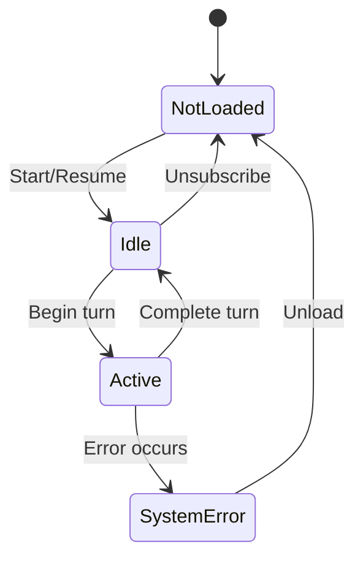

Codex CLI is built around three core primitives that structure how you interact with the AI agent. Understanding these concepts will help you work more effectively with Codex.

## Architecture

Codex uses a conversation-based model where each interaction is structured into distinct units:

<CardGroup cols={3}>
  <Card title="Threads" icon="comments" href="#threads">
    Conversations between you and the agent
  </Card>
  <Card title="Turns" icon="arrow-right-arrow-left" href="#turns">
    Individual exchanges within a conversation
  </Card>
  <Card title="Items" icon="list" href="#items">
    Atomic units of input and output
  </Card>
</CardGroup>

## Threads

A **thread** represents a complete conversation between you and the Codex agent. Each thread:

- Contains a history of all interactions (turns)
- Maintains context across multiple exchanges
- Persists to disk as a JSONL rollout file
- Has its own configuration (model, working directory, sandbox settings)

Threads are identified by a unique ID (e.g., `thr_123`) and can be:
- Started fresh with `codex` or `thread/start`
- Resumed from disk with `codex resume` or `thread/resume`
- Forked into new branches with `thread/fork`
- Archived when no longer needed

### Thread lifecycle

## Turns

A **turn** represents one round of interaction, typically:
1. You provide input (message, image, skill invocation)
2. The agent processes your request
3. The agent responds and executes actions

Each turn has a status:
- `inProgress` - Currently executing
- `completed` - Finished successfully  
- `interrupted` - Cancelled by user
- `failed` - Encountered an error

Turns are identified by IDs like `turn_456` and can be interrupted mid-execution using `turn/interrupt`.

## Items

Items are the atomic units that make up a turn. They represent both inputs and outputs:

### Input items
- **userMessage** - Text or images you provide
- **skill** - Skill invocations (e.g., `$skill-creator`)
- **mention** - App invocations

### Output items
- **agentMessage** - Text responses from the agent
- **reasoning** - Internal reasoning steps (for supported models)
- **plan** - High-level plan for multi-step tasks
- **commandExecution** - Shell commands executed in the sandbox
- **fileChange** - File modifications (edits, creates, deletes)
- **mcpToolCall** - MCP (Model Context Protocol) tool invocations
- **webSearch** - Web search queries and results
- **imageView** - Image viewing operations

### Item lifecycle

Every item follows a consistent lifecycle:

<Steps>
  <Step title="Item started">
    The `item/started` event is emitted with initial metadata
  </Step>
  <Step title="Streaming updates">
    Item-specific delta events stream incremental progress (e.g., `item/agentMessage/delta`)
  </Step>
  <Step title="Item completed">
    The `item/completed` event provides the final, authoritative state
  </Step>
</Steps>

## Execution modes

Codex supports two primary execution modes:

<CardGroup cols={2}>
  <Card title="Interactive mode" icon="terminal" href="/concepts/interactive-mode">
    Full TUI with rich display, history, and navigation
  </Card>
  <Card title="Non-interactive mode" icon="robot" href="/concepts/non-interactive-mode">
    Headless execution for automation and CI/CD
  </Card>
</CardGroup>

### Interactive mode

Launched with the `codex` command, interactive mode provides:
- Real-time terminal user interface (TUI)
- Streaming output as the agent works
- Keyboard shortcuts for navigation and control
- Visual feedback for approvals and errors

Best for: Development, debugging, exploratory tasks

### Non-interactive mode

Launched with `codex exec` or `codex review`, non-interactive mode provides:
- Programmatic execution without a TUI
- JSONL event streaming for parsing
- Exit codes for automation
- Structured output formats

Best for: CI/CD pipelines, scripts, automated workflows

## Security model

Codex implements multiple security layers:

<CardGroup cols={2}>
  <Card title="Sandboxing" icon="shield-halved" href="/concepts/sandboxing">
    Platform-specific filesystem and network isolation
  </Card>
  <Card title="Approvals" icon="circle-check" href="/concepts/approvals">
    User control over sensitive operations
  </Card>
</CardGroup>

### Sandboxing

All commands run in a sandbox by default, using platform-specific technologies:
- **Linux**: Landlock + seccomp (or Bubblewrap)
- **macOS**: Seatbelt (App Sandbox)
- **Windows**: Restricted tokens + job objects

Sandbox modes:
- `read-only` - Only file reads permitted
- `workspace-write` - Writes allowed in working directory
- `danger-full-access` - No sandbox restrictions

### Approvals

The approval system controls when human oversight is required:
- **never** - Auto-approve all operations
- **on-request** - Approve when sandbox escalation needed
- **unless-trusted** - Always approve unless trusted by policy
- **on-failure** - Only approve after sandbox failures

## Data persistence

Codex stores data in your Codex home directory (typically `~/.codex/`):

- **Sessions** (`sessions/`) - Active thread rollouts
- **Archived** (`sessions_archived/`) - Archived conversations  
- **Config** (`config.toml`) - User configuration
- **Skills** (`skills/`) - Custom skills and tools
- **Cache** (`cache/`) - Temporary data and indexes

<Note>
  Thread data is stored as JSONL (JSON Lines) for human readability and easy processing with standard tools.
</Note>

## Next steps

<CardGroup cols={2}>
  <Card title="Interactive mode" icon="terminal" href="/concepts/interactive-mode">
    Learn keyboard shortcuts and TUI features
  </Card>
  <Card title="Non-interactive mode" icon="code" href="/concepts/non-interactive-mode">
    Integrate Codex into your automation
  </Card>
  <Card title="Sandboxing" icon="lock" href="/concepts/sandboxing">
    Understand the security model
  </Card>
  <Card title="Approvals" icon="user-check" href="/concepts/approvals">
    Configure approval policies
  </Card>
</CardGroup>